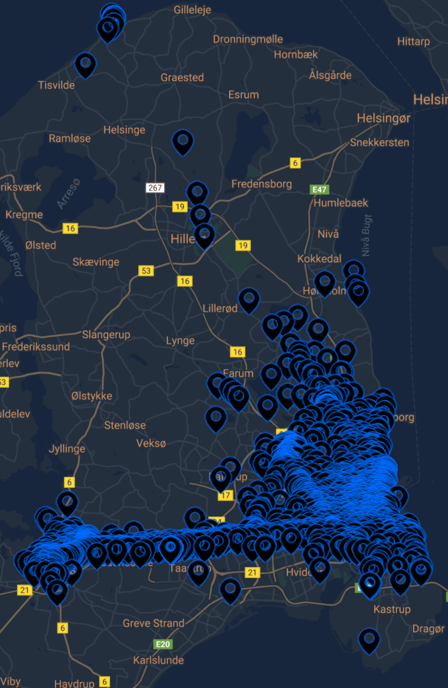

# Display multiple coordinates with Google Maps API

I used this as a quick setup for one of my courses during my studies at IT University of Copenhagen where I attempted to analyse and describe all personal data that Facebook collects and uses. Here is a figure from the report and more below you can see the different examples of themes one can choose.

## Example from report

Dark design             |  Light design
:-------------------------:|:-------------------------:
  |  
